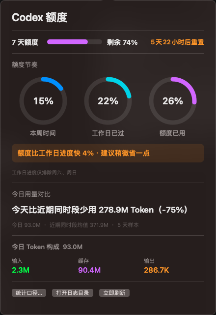

# Codex 额度仪表

macOS 原生菜单栏工具，把 Codex 周额度变成随时可见的“电量表”。无需反复打开命令行：抬眼即可看到剩余额度，点击后还能判断当前消耗是否跑得太快。

[](https://github.com/hzlijiacheng-svg/codex-quota-widget/releases/latest/download/Codex-Weekly-Quota-Menubar-v2.0.1-macOS-universal.zip)

**[直接下载 Codex 额度仪表 v2.0.1](https://github.com/hzlijiacheng-svg/codex-quota-widget/releases/latest/download/Codex-Weekly-Quota-Menubar-v2.0.1-macOS-universal.zip)** · [查看全部版本](https://github.com/hzlijiacheng-svg/codex-quota-widget/releases)

> 支持 macOS 12 及以上、Intel 与 Apple 芯片。当前正式启用 Codex 数据源；GLM/企业 AI 网关仍在适配中。

## 界面预览

| 点击面板 | Touch Bar |
| --- | --- |
|  |  |

## 产品功能

### 菜单栏：周额度一眼可见

- 只显示一条周额度血条和带 `%` 的剩余额度，省去含义重复的 `7d`。
- 低占用设计，兼顾旧款 Mac 较窄的菜单栏空间。
- 每 5 分钟自动刷新，也可从面板立即刷新。

### 三环节奏：告诉你该不该省

点击菜单栏图标后，三个环形进度会同时展示：

- **本周时间**：当前 7 天额度周期已经过去多少。
- **工作日已过**：在相同周期内，仅计算周一至周五的进度。
- **额度已用**：Codex 周额度已经消耗多少。

工具会直接比较“额度已用”和“工作日已过”，输出“建议稍微省一点”“建议大幅节省”“小额富余”或“大额富余”，避免用户自行换算。工作日口径仅排除周六、周日，暂不识别法定节假日和调休。

### 重置时间与额度窗口

- 展示 Codex 返回的全部可用额度窗口。
- 周额度、剩余百分比和重置倒计时保持在同一行。
- 重置时间使用更醒目的颜色，减少扫读成本。

### Token 消耗看板

- 统计今日 Token 总量，并拆分为输入、缓存输入和输出。
- 比较“今天截至当前时刻”和“此前 7 个自然日相同时段”的平均值。
- 同时展示绝对 Token 差值与相对百分比；历史样本少于 3 天时不武断判断快慢。
- 首次启动在后台扫描最近 8 天日志，后续只读取新增内容。

### Touch Bar 常驻仪表

在带 Touch Bar 的 Mac 上显示细长的周额度仪表：

- 明确标注“Codex 周额度”，不使用含义不明的单字母。
- 展示长血条、剩余百分比、已用百分比、重置倒计时和工作日节奏。
- 左侧显示额度，右侧继续保留亮度、音量等系统控制。
- 应用退出或卸载后，恢复启动前的 Touch Bar 显示模式。

### 自动适配代理与直连

不同电脑无需准备配置文件。读取额度时按以下顺序自动尝试：

1. `HTTP_PROXY` / `HTTPS_PROXY` 等进程环境代理；
2. macOS 当前系统代理；
3. 无代理直连。

某条链路失败后才切换下一条。支持常见固定地址 HTTP/HTTPS/SOCKS 代理；PAC 自动代理脚本及需要额外认证的企业代理暂未自动解析。

## 安装

1. 从页面顶部下载最新版并解压。
2. 双击 `安装.command`。
3. 如果 macOS 提示无法验证开发者，右键点击安装文件，选择“打开”。
4. 安装完成后，菜单栏会立即出现额度血条；以后登录 macOS 时自动启动。

前提：电脑已安装并登录 ChatGPT/Codex 桌面端，或已登录 Codex CLI。

## 卸载

双击安装包中的 `卸载.command`。应用和登录启动项会移到废纸篓，Touch Bar 会恢复原来的显示模式。

## 数据与隐私

- 额度通过本机 Codex `app-server` 读取，不读取或保存账号令牌。
- Token 统计只解析 `~/.codex/sessions` 中的 `token_count` 数值。
- 不解析提示词、回复或代码正文，也不会把统计数据上传到第三方。
- “打开日志目录”只会在 Finder 中打开目录，不会修改日志。
- 数据不可核验时明确显示暂无数据或错误，不编造额度。

Codex 本地接口属于实验性接口。未来 Codex 升级后若字段发生变化，本项目可能需要同步更新。

## 从源码运行

```bash
git clone https://github.com/hzlijiacheng-svg/codex-quota-widget.git
cd codex-quota-widget
./test.command
./run.command
```

常用命令：

| 命令 | 用途 |
| --- | --- |
| `./test.command` | 运行额度节奏、Token 统计、代理回退和 Touch Bar 测试 |
| `./build.command` | 构建 macOS 应用 |
| `./run.command` | 构建并启动菜单栏应用 |
| `./install.command` | 安装到当前用户目录并配置登录启动 |
| `./package.command` | 生成 Intel + Apple 芯片通用分享包 |
| `.build/CodexQuotaWidget.app/Contents/MacOS/CodexQuotaWidget --print` | 只读取并打印当前额度 |

## 数据来源与兼容边界

- Codex 可执行文件依次从 `CODEX_QUOTA_CODEX_PATH`、ChatGPT/Codex 应用内置位置和 Homebrew 常见目录发现。
- 展示的是 Codex 账户额度，不等同于 ChatGPT 网页版各模型的消息次数上限。
- 当前运行版本只启用 Codex。GLM Coding Plan 与企业网关代码仍处于适配阶段，不作为正式能力宣传。
- 没有 Touch Bar 的 Mac 会自动忽略 Touch Bar 功能，不影响菜单栏与点击面板。

## 反馈与贡献

遇到额度读取、菜单栏显示或 Touch Bar 兼容问题，请提交 [Issue](https://github.com/hzlijiacheng-svg/codex-quota-widget/issues)，并附上 macOS 版本、安装方式和脱敏后的错误信息。请勿上传 API Key、Cookie、AccessKey 或公司内部网关地址。
